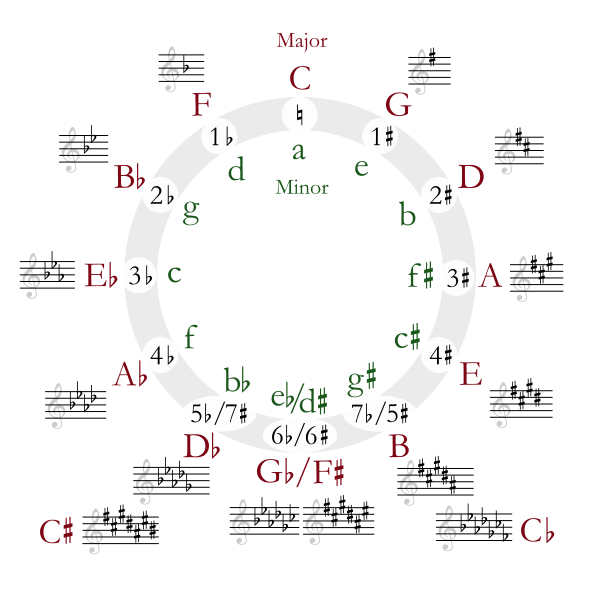
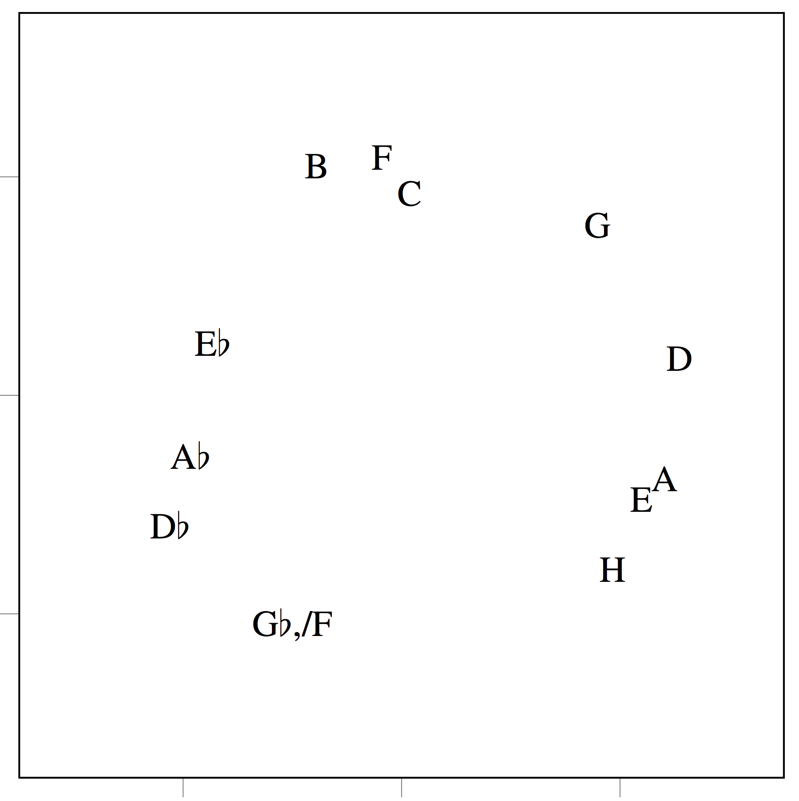

# JamBot: Music Theory Aware Chord Based Generation of Polyphonic Music with LSTMs

## Paper

JamBot: Music Theory Aware Chord Based Generation of Polyphonic Music with LSTMs", presented at ICTAI 2017. 

https://arxiv.org/abs/1711.07682

### Main Results

* When JamBot is trained on an unshifted dataset, i.e., all songs are left in their respective keys, the learned chord embeddings form the circle of fifths.

Circle of Fifths            | 2D Projection of Chord Embeddings
:-------------------------:|:-------------------------:
  |  
(Source: By Just plain Bill - Own work, CC BY-SA 3.0, https://commons.wikimedia.org/w/index.php?curid=4463183) |

* JamBot can create harmonic music with some longer term structure, thanks to its hierarchical structure. Samples can be listened to at: https://www.youtube.com/channel/UCQbE9vfbYycK4DZpHoZKcSw

## Setup

Make sure you have the following Python packages installed. In brackets we indicate the latest tested version numbers (Last updated: 11th April 2018)

* keras (2.1.5)
* tensorflow-gpu (1.6.0)
* numpy (1.14.2)
* pretty_midi (0.2.8)
* mido (1.2.8)
* progressbar2 (3.37.0)
* matplotlib (2.2.2)
* h5py (2.7.1)

All tested with Python 3.5.4 (Last updated: 11th April 2018).


## Dataset

We used the lmd_matched subset of the Lakh Midi Dataset, which can be downloaded here: https://colinraffel.com/projects/lmd/

## Data Processing

Create the data/original directory and put your MIDI files inside it.
Run data_processing.py to adjust the tempo and shift the midi songs, extract the chords and piano rolls. This might take some time.
There may be some error messages printed due to invalid MIDI files.
There should now be several new sub-directories in /data/.

## Training

First we train the Chord LSTM by running:  
```bash
python chord_lstm_training.py
```
Model checkpoints will be periodically saved to the (default) directory /models/chords/.

Now we can train the Polyphonic LSTM. First we need to adjust the chord_model_path string in polyphonic_lstm_training.py to point to a Chord LSTM checkpoint in /models/chords/ (we need this for the learned chord embeddings). 
Finally we can train the Polyphonic LSTM:
```bash
python polyphonic_lstm_training.py
```
Model checkpoints will be periodically saved to the (default) directory /models/chords_mldy/. 

## Generating

Adjust the chord_model_folder, chord_model_name, melody_model_folder, melody_model_name strings in generate.py to point them to trained chord and polyphonic LSTMs models in models/.
Adjust the seed_path, seed_chord_path and seed_name in generate.py to point it to the extracted chords (in the data/shifted/chord_index folder) and piano roll (in the data/shifted/indroll folder) of the desired seed.
Adjust the BPM, note_cap, and chord_temperature parameters if desired and run
```bash
python generate.py
```
to generate a song. The song will be saved with a few different instrumentiations in midi_save_folder (default is predicted_midi/).

